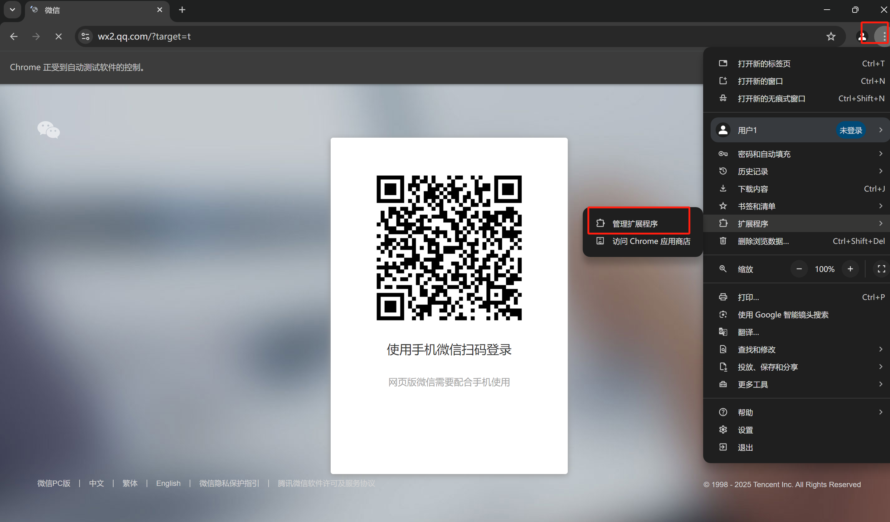
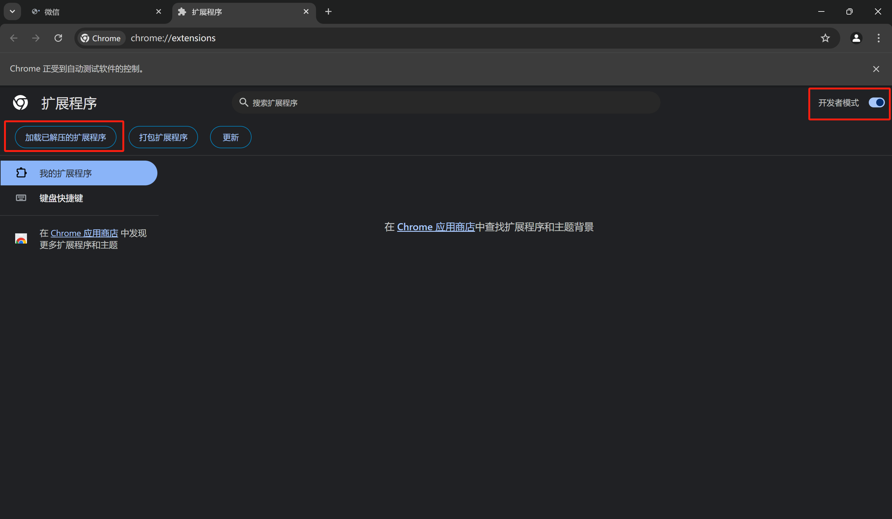

# wechat-auto-reply-bot


## 项目概述

该项目是一个自动回复微信消息的脚本，结合了Selenium和大型语言模型API来实现自动回复功能。它可以帮助你在微信网页版中自动回复指定联系人的消息。

## 从代码中读取的内容

1. **功能**: 该脚本能够自动回复微信网页版中指定联系人的消息，回复内容由大型语言模型生成。
2. **技术**: 使用Selenium控制Chrome浏览器，操作微信网页版；调用大语言模型API生成回复内容。
3. **前置条件**: 需要安装Chrome浏览器和Selenium驱动，以及配置大型语言模型的API Key。
4. **注意事项**: 由于谷歌的反爬机制，直接运行脚本可能会遇到登录问题，需要手动加载特定的Chrome插件。

## 前置工作

1. **大型语言模型API Key**:
   - 你需要拥有一个大型语言模型的API Key，例如OpenAI的API Key。
   - 在代码中`self.client = OpenAI(api_key="", base_url="https://dashscope.aliyuncs.com/compatible-mode/v1")`处填写你的API Key。
   - 不同大型语言模型的API调用方式可能有所不同，请参考相应大型语言模型的官方文档进行配置。

## 安装插件

1. **插件下载**:
   - 你需要安装一个特定的Chrome插件，该插件允许在Chrome浏览器中打开微信网页版。（如果有别的方法打开微信网页版那更好，确保右键检查能看到元素）
   - 插件代码下载地址: [wechat-need-web](https://github.com/lqzhgood/wechat-need-web/releases)

2. **操作描述**:
   - 详细的操作步骤请参考: [知乎文章](https://zhuanlan.zhihu.com/p/754480320)

## 使用步骤

1. **运行脚本**:
   - 直接运行脚本即可。进入py文件所在目录，然后：
   - `` python wechat_auto_reply.py ``
   - 代码会开始运行。
   - 运行脚本时，系统会要求你输入自己的微信名称和需要自动回复的用户名称。
   - 例如：
     ```
     请输入配置信息：
     请输入您的微信名称: 你的微信名称
     请输入需要自动回复的用户名称（多个用逗号分隔）: 用户1, 用户2
     ```
   - 如果不需要输入这些信息，可以在代码中进行修改。

3. **处理登录问题**:
   - 由于谷歌的反爬机制，直接运行脚本可能会导致无法扫码登录。
   - **解决方案**:
     1. 打开Chrome浏览器窗口后，手动加载插件（`chrome://extensions/`）。（我在本地运行时，已经加载了插件的谷歌浏览器和程序自动打开的是两个浏览器；因此每次在程序打开的浏览器里都手动操作加入了插件。这一步应该是可以省掉的，之后再说）
     2. 将下载的插件解压后，点击“加载已解压的扩展程序”，选择插件文件夹。
     3. 使用微信小号扫码登录。
     
     
4. **开始自动回复**:
   - 登录成功后，脚本会开始监听消息，并自动回复指定用户的最新消息。

## 技术细节

- **网页爬虫操作**: 使用Selenium操作微信网页版，获取和发送消息。
- **扩展程序加载微信**: 插件使得微信网页版在Chrome中正常运行，对话框内的元素结构清晰，便于Selenium操作。
- **大型语言模型回复**: 使用大型语言模型生成回复内容，回复内容简短，并根据内容长度设置停顿时间，减少被检测的风险。

## 亮点

- **回复简短且有停顿**: 每次调用大型语言模型时，提示词要求回复简短，并根据回复长度设置停顿时间，降低被检测的风险。
- **自动回复功能**: 自动回复指定用户的最新消息，节省时间和精力。

## 其他

- **封号风险**: 由于使用了插件和脚本，可能会被微信或谷歌检测到，存在封号风险。请谨慎使用。（目前，经过对比测试发现只要安装了插件就会被警告；但是这个脚本和自动回复会不会被检测到，目前还不清楚，sigh~）
- **功能和局限**:
  1. **指定用户回复**: 目前只能回复配置中指定的用户，且需要手动点击对话对象。
  2. **提示词简陋**: 提示词比较简单，可能需要根据具体需求进行优化。
  3. **未引入记忆机制**: 目前调用大模型的代码部分只是简单的单次回复，暂时没有引入记忆。
 


# WeChat Auto Reply Bot

## Project Overview

This project is a script that automatically replies to WeChat messages using Selenium and a large language model API. It helps you automatically reply to specified contacts in WeChat Web版.

## What I Read from the Code

1. **Functionality**: The script automatically replies to messages from specified contacts in WeChat Web版, with reply content generated by a large language model.
2. **Technology**: Uses Selenium to control the Chrome browser and operate WeChat Web版; calls a large language model API to generate reply content.
3. **Prerequisites**: Requires Chrome browser and Selenium driver installed, and a large language model API Key configured.
4. **Notes**: Due to Google's anti-crawling mechanism, running the script directly may cause login issues, requiring manual installation of a specific Chrome plugin.

## Preparations

1. **Large Language Model API Key**:
   - You need to have a large language model API Key, such as OpenAI's API Key.
   - Fill in your API Key in the code at `self.client = OpenAI(api_key="", base_url="https://dashscope.aliyuncs.com/compatible-mode/v1")`.
   - The API call methods for different large language models may vary; refer to the official documentation of the corresponding large language model for configuration.

## Install Plugin

1. **Plugin Download**:
   - You need to install a specific Chrome plugin that allows WeChat Web版 to be opened in the Chrome browser. (If there is another method to open WeChat Web版, ensure that you can inspect the elements by right-clicking.)
   - Plugin code download address: [wechat-need-web](https://github.com/lqzhgood/wechat-need-web/releases)

2. **Operation Description**:
   - Detailed operation steps: [Zhihu Article](https://zhuanlan.zhihu.com/p/754480320)

## Usage Steps

1. **Run Script**:
   - Run the script directly. Navigate to the directory containing the py file, then:
   - `` python wechat_auto_reply.py ``
   - The code will start running.
   - When running the script, the system will prompt you to enter your WeChat name and the names of users you want to automatically reply to.
   - For example:
     ```
     Please enter configuration information:
     Please enter your WeChat name: your WeChat name
     Please enter the names of users you want to automatically reply to (separated by commas): User1, User2
     ```
   - If you do not need to enter this information, you can modify the code accordingly.

2. **Handle Login Issues**:
   - Due to Google's anti-crawling mechanism, running the script directly may result in inability to scan and log in.
   - **Solution**:
     1. After opening the Chrome browser window, manually load the plugin (`chrome://extensions/`). (When running locally, the browser with the plugin already loaded and the browser opened by the program are two separate browsers; therefore, the plugin is manually added to the browser opened by the program each time. This step should be avoidable, to be addressed later.)
     2. Unzip the downloaded plugin and click "Load unpacked extension", then select the plugin folder.
     3. Use a WeChat sub-account to scan and log in.
     
     

3. **Start Auto Reply**:
   - After successful login, the script will start monitoring messages and automatically reply to messages from specified users.

## Technical Details

- **Webpage Crawling**: Uses Selenium to operate WeChat Web版,获取和发送消息。
- **Extension Program Loads WeChat**: The plugin allows WeChat Web版 to run normally in Chrome, with a clear structure of dialogue box elements,便于Selenium操作。
- **Large Language Model Reply**: Uses a large language model to generate reply content, with简短的回复内容 and a pause set according to the content length, reducing the risk of detection.

## Highlights

- **Short Reply with Pause**: Each call to the large language model requests a brief reply, and sets a pause according to the content length, reducing the risk of detection.
- **Auto Reply Function**: Automatically replies to the latest messages from specified users, saving time and effort.

## Others

- **Risk of Account Ban**: Due to the use of plugins and scripts, there may be a risk of being detected by WeChat or Google, resulting in account ban. Use with caution. (Currently, comparative testing has found that just installing the plugin triggers a warning; however, it is unclear whether this script and auto-reply will be detected, sigh~)
- **Function and Limitations**:
  1. **Reply to Specified Users**: Currently, it can only reply to specified users in the configuration, and requires manual clicking on the conversation object.
  2. **Simple Prompt**: The prompt is simple and may need to be optimized according to specific needs.
  3. **No Memory Mechanism Introduced**: The current code for calling the large model is a simple single reply, with no memory introduced yet.
